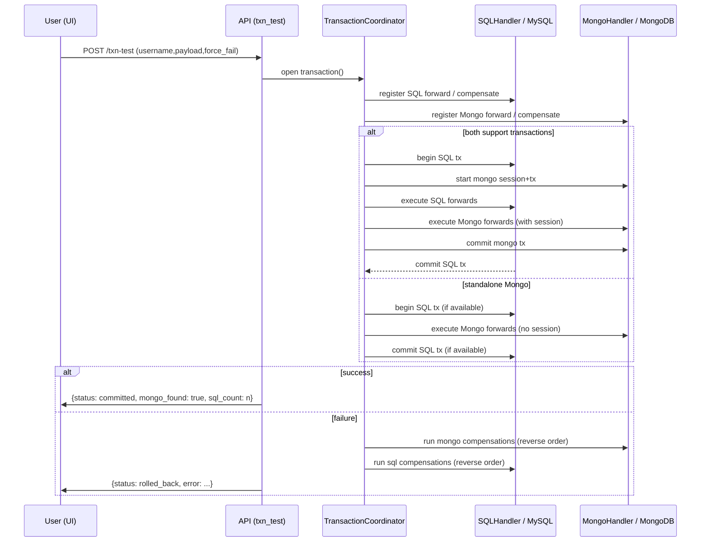

Changes implemented (2026-03-30):
  - API key guard: when `DASHBOARD_API_KEY` is set in the environment, the endpoint `/api/tools/json-query` requires the header `X-API-Key` with the matching value.
  - Query size limit: incoming query payloads are size-checked and rejected when excessively large (default cap applied).
  - Collection name validation: collection names are validated against a safe pattern (alphanumeric, underscore, dash, dot).
  - Operator whitelist: only a small set of Mongo operators are allowed (`$eq,$gt,$gte,$lt,$lte,$in,$nin,$ne,$and,$or,$not,$exists,$size`). Dangerous operators such as `$where`, `$function`, `$eval`, and similar are rejected.
  - Execution time limit: server applies `maxTimeMs` (default 2000ms, capped by configuration) to the Mongo cursor to limit query execution time.
  - Result limit cap: user-provided `limit` is clamped to a safe maximum (default 100) to prevent very large responses.

Authentication & RBAC (2026-03-30):
  - Added a lightweight token-based authentication module in `web/auth.py`.
  - Login endpoint: `POST /api/login` (username/password) returns a signed token. Tokens are HMAC-SHA256 signed and include `username`, `role`, and `exp`.
  - Role-based access control:
    - `admin` role is required for ACID coordinated tests (`/txn-test` and `/api/tools/acid-test-auth`).
    - JSON queries (`/api/tools/json-query`) require authentication (either Bearer token or `X-API-Key`) and allow users with `user` or `admin` roles.
  - User configuration: users can be supplied via `DASHBOARD_USERS` environment variable (format `user:pass:role,user2:pass2:role2`) or `DASHBOARD_ADMIN_PASS` for a single admin user. If none provided a default `admin/admin` dev user is created (not secure) — set env vars for production.

  These changes add server-side access control and improve safety for the dashboard endpoints. See `web/auth.py` and `web/dashboard.py` for implementation details.

Rate limiting (2026-03-30):
  - Implemented an in-memory token-bucket rate limiter in `web/dashboard.py`.
  - Configurable via environment variables `RATE_LIMIT_CAPACITY` and `RATE_LIMIT_REFILL_PER_SEC`.
  - The limiter keys on authenticated username when available, otherwise on client IP (X-Forwarded-For support).
  - Exceeding the quota returns HTTP 429 with a `Retry-After` header.
  - For production use, replace or augment the in-memory store with a centralized backend (Redis) to enforce global limits across processes.
# ACID Testing & JSON Query Design

Date: 2026-03-30

Purpose
-------
This document describes how user JSON queries are generated and executed by the dashboard, the current system architecture for handling queries, and the ACID testing flow implemented in `web/dashboard.py` and `core/transaction_coordinator.py`. It also includes flow diagrams and recommended next steps.

1) High-level overview
----------------------
- User-facing UI: minimal dashboard served at `/` (file: `web/static/index.html`). The UI contains a JSON Query panel where users paste or type a JSON document and press "Run Query".
- API: FastAPI app in `web/dashboard.py` exposes `POST /api/tools/json-query` for running JSON queries and `POST /api/tools/acid-test` (or `/txn-test`) for ACID-style coordinated transactions.
- Storage handlers: `db/mongo_handler.py` exposes a `MongoHandler` wrapping a `pymongo.MongoClient` and database; `db/sql_handler.py` exposes a `SQLHandler` handling MySQL connections and optionally an SQLAlchemy `engine`.
- Coordinator: `core/transaction_coordinator.py` provides a `TransactionCoordinator` and `Transaction` classes implementing a SAGA-style coordination with optional real transactions when supported by both backends.

2) How queries are generated (current implementation)
---------------------------------------------------

- UI generation:
  - The JSON Query panel in `web/static/index.html` provides a `textarea` (`#json-input`) where users paste or type JSON.
  - The panel includes a `collection` input and a `limit` input. When the user clicks Run, the UI sends a POST request to `/api/tools/json-query` with body: `{ "collection": "<collection>", "query": <JSON object>, "limit": <n> }`.

- Server handling (in `web/dashboard.py`):
  - The endpoint `api_json_query` reads `collection`, `query`, and `limit` from the request JSON.
  - It runs `docs = list(mongo_handler.db[collection].find(query).limit(limit))` and converts `_id` fields to strings for JSON serialization.

Security / validation notes (current state):
  - Historically the server executed the provided JSON query directly against MongoDB; that exposed risk (expensive queries, `$where`, operator abuse).
  - Recommended additions included: query size / execution time limits, query operator whitelist, authentication/authorization, and query validation/sandboxing.

Changes implemented (2026-03-30):
  - API key guard: when `DASHBOARD_API_KEY` is set in the environment, the endpoint `/api/tools/json-query` requires the header `X-API-Key` with the matching value.
  - Query size limit: incoming query payloads are size-checked and rejected when excessively large (default cap applied).
  - Collection name validation: collection names are validated against a safe pattern (alphanumeric, underscore, dash, dot).
  - Operator whitelist: only a small set of Mongo operators are allowed (`$eq,$gt,$gte,$lt,$lte,$in,$nin,$ne,$and,$or,$not,$exists,$size`). Dangerous operators such as `$where`, `$function`, `$eval`, and similar are rejected.
  - Execution time limit: server applies `maxTimeMs` (default 2000ms, capped by configuration) to the Mongo cursor to limit query execution time.
  - Result limit cap: user-provided `limit` is clamped to a safe maximum (default 100) to prevent very large responses.

  These protections are implemented in `web/dashboard.py` in the `api_json_query` handler with a recursive query validator and basic sanity checks. See the "Appendix: key files" for the exact file.

3) ACID testing logic (what it runs and why)
-------------------------------------------

Entry points
  - `POST /api/tools/acid-test` and `POST /txn-test` call the same underlying function (`txn_test`) which runs the coordinated ACID-like test.

Test steps (implementation summary)
  1. `txn_test` generates a unique `uuid` and a `username` (or uses provided `username`).
  2. It defines two forward operations and two compensating operations:
     - SQL forward: INSERT into table `structured_data (username, timestamp, sys_ingested_at)`.
     - SQL compensate: DELETE FROM `structured_data` WHERE username = :username.
     - Mongo forward: insert a document into collection `txn_test` with `uuid`, `username`, and `payload`.
     - Mongo compensate: delete the document by `uuid`.
  3. It opens a `with tc.transaction() as t:` block where `t.add_sql(...)` and `t.add_mongo(...)` register forwards and compensations.
  4. If `force_fail` is true the code raises a `RuntimeError` to simulate a partial failure and force compensating logic.
  5. On successful completion of the `with` block, the function checks for the presence of the Mongo document and a SQL row count and returns JSON indicating `committed` and the presence of data. On exception the function returns `rolled_back` and the same presence checks to confirm compensations.

TransactionCoordinator behavior (detailed)
  - When `_commit()` runs, it first checks whether a MongoDB transaction is possible by calling `self.mongo.client.admin.command('ismaster')` and verifying `setName` exists (i.e., server is a replica set member).
  - If Mongo supports transactions and `self.sql` exposes an SQLAlchemy engine, the coordinator will:
      * Begin a SQL transaction via `self.sql.engine.begin()` (context manager).
      * Start a MongoDB session and call `mongo_session.start_transaction()`.
      * Execute SQL forward operations inside the SQL transaction context.
      * Execute Mongo forward operations with the same `mongo_session` while SQL transaction is still open to reduce race window.
      * Commit the Mongo transaction (`mongo_session.commit_transaction()`), then allow the SQL context manager to commit the SQL transaction.
  - If Mongo is standalone (no replica set), the coordinator will NOT start a Mongo session. Instead it will execute Mongo forward operations directly (no transaction) and rely on registered compensating actions (SAGA-style) in case a later operation fails.
  - On any exception during forwards or commit, the coordinator runs compensating actions in reverse order: first Mongo compensations (reverse), then SQL compensations (reverse). When SQL has an engine, compensations are run inside a new SQL transaction where possible.

Ordering and idempotency
  - The design assumes compensating actions are sufficiently idempotent (DELETE by `uuid` or `username`) and that clients can re-run tests.
  - For production-grade durability and to handle in-doubt transactions, a persistent transaction log (WAL) and recovery worker should be added.

4) Flow diagrams
-----------------

Architecture diagram (flow):

```mermaid
graph LR
  UI[Browser UI (index.html)] -->|POST /api/tools/json-query| API[FastAPI (web/dashboard.py)]
  UI -->|POST /api/tools/acid-test| API
  API --> MongoH[MongoHandler (db/mongo_handler.py)]
  API --> SQLH[SQLHandler (db/sql_handler.py)]
  API --> TC[TransactionCoordinator (core/transaction_coordinator.py)]
  TC --> SQLH
  TC --> MongoH
  SQLH --> MySQL[(MySQL)]
  MongoH --> Mongo[(MongoDB)]
```

ACID Test sequence (simplified):



5) Observability and result checks
----------------------------------
- `txn_test` queries the database after commit/rollback:
  - `mongo_handler.db['txn_test'].find_one({'uuid': uid})` to see if the document exists.
  - SQL: SELECT COUNT(*) FROM `structured_data` WHERE username = %s to count rows.
- These checks are used to show the UI whether the commit/rollback had the expected effect.

6) Limitations and recommendations
----------------------------------
- Current limitations:
  - Mongo queries from UI are run as-provided with no validation or RBAC enforcement.
  - No persistent transaction log (WAL) for in-doubt transactions or crash recovery.
  - Compensating actions must be idempotent or safely re-runnable.

- Recommendations:
  1. Add server-side query validation and rate/execution limits for `json-query`.
  2. Add authentication & RBAC for dashboard APIs.
  3. Implement a persistent transaction log for the coordinator and a recovery worker.
  4. Add idempotency tokens to forward operations to make compensations safer.
  5. For reproducible Mongo transactions in development, enable a single-node replica set.

7) Examples
-----------

Example curl JSON query (returns up to 10 results from `unstructured_data`):

```bash
curl -s -X POST http://localhost:8000/api/tools/json-query \
  -H 'Content-Type: application/json' \
  -d '{"collection":"unstructured_data","query":{"name":"Alice"},"limit":10}' | jq
```

Example curl ACID test (force rollback):

```bash
curl -s -X POST http://localhost:8000/api/tools/acid-test \
  -H 'Content-Type: application/json' \
  -d '{"username":"ui_test","payload":{"x":1},"force_fail":true}' | jq
```

Appendix: key files
-------------------
- `web/static/index.html` — Dashboard UI
- `web/static/app.js` — Client JS wiring the UI to the API
- `web/dashboard.py` — FastAPI app with `/api/tools/json-query` and `/api/tools/acid-test` endpoints
- `core/transaction_coordinator.py` — SAGA-style coordinator with optional real transactions
- `db/mongo_handler.py`, `db/sql_handler.py` — DB handlers

Contact / Next steps
--------------------
If you want, I can:
- Add server-side query validation and a preview of estimated result counts before executing.
- Implement a persistent coordinator WAL and a recovery routine.
- Enhance the UI to persist recent queries and provide a query history panel.
